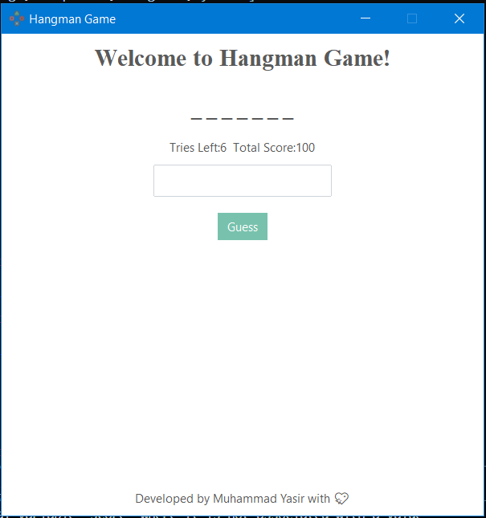

# 🕹️ Hangman Game - Tkinter + ttkbootstrap

A modern graphical **Hangman Game** built with Python using the `ttkbootstrap` framework, designed as part of the **#CodeAlpha Internship** project.

---

## 📌 Features

- 🎨 GUI built using `ttkbootstrap` for a modern, responsive look
- 🧠 Random word selection from a built-in list
- 📉 Tracks number of tries (max 6 wrong attempts)
- ⭐ Displays live score (correct guesses)
- 🔠 Shows guessed letters (correct and incorrect)
- ✅ Auto-focus input for smooth gameplay
- 🚫 Prevents duplicate or invalid entries

---

## 📸 Screenshot

---

## 🚀 Getting Started

### ✅ Requirements
- Python 3.6+
- `ttkbootstrap` (install with pip)

pip install ttkbootstrap

👨‍💻 Author
Muhammad Yasir 
🎓 BSCS Final Year Student
💼 Intern at CodeAlpha
📍 Dera Ismail Khan, Pakistan

📧 Email: [yaisikhan111@gmail.com]
🔗 LinkedIn: [linkedin.com/in/muhammad-yasir-a63146297]
🔗 GitHub: [github.com/Expert610]

📚 Internship Info
This project is submitted as part of the Python Programming Internship at CodeAlpha.tech.

📝 License
This project is for educational purposes and open to modify or improve for learning.
